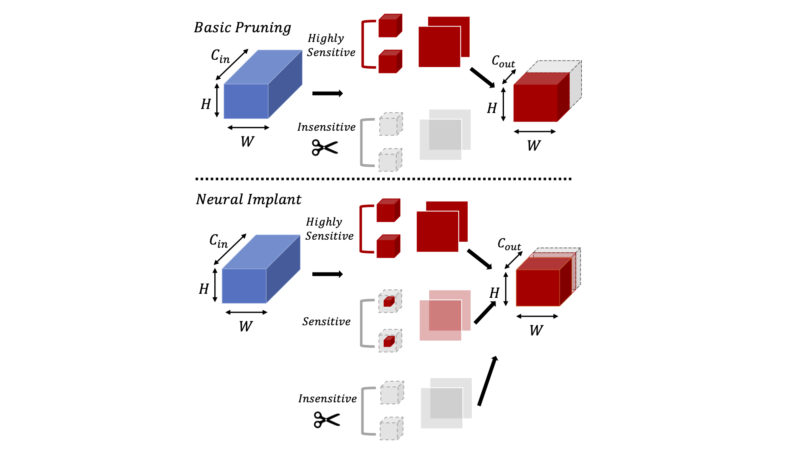

<p align="center">
  
  <br />
  <br />
  </p>


# Hessian-Aware Pruning and Optimal Neural Implant

HAP is an advanced structured pruning library written for PyTorch. HAP prunes channels based on their second-order sensitivity. Channels are sorted based on this metric, and only insensitive channels are pruned. In the Neural Implant method, channels with moderate sensitivity levels are replaced with a trainable implant.


## Installation

- [PyTorch](http://pytorch.org/) version >= 1.4.0
- Python version >= 3.6
- **To install HAP** and develop locally:

```
git clone https://github.com/yaozhewei/HAP
```

* Then run

```bash
bash install.sh
```


## Quick Start

1. Pretraining:

   ```bash
   # for pretraining CIFAR10
   $ python main_pretrain.py --learning_rate 0.1 --weight_decay 0.0002 --dataset cifar10 --epoch 200
   ```

   

2. Testing without Neural Implant on CIFAR10

   ```bash
   python main_prune.py --network resnet --depth 56 --dataset cifar10 --batch-size 64 --learning-rate 0.02 --weight-decay 4e-4 --ratio 0.5 --use-decompose 0 --gpu "0"
   ```

   


## Related Work

- [Hessian-Aware Pruning and Optimal Neural Implant](https://arxiv.org/abs/2101.08940)


## License

HAP is released under the [MIT license](https://github.com/Zhen-Dong/HAWQ/blob/main/LICENSE).
